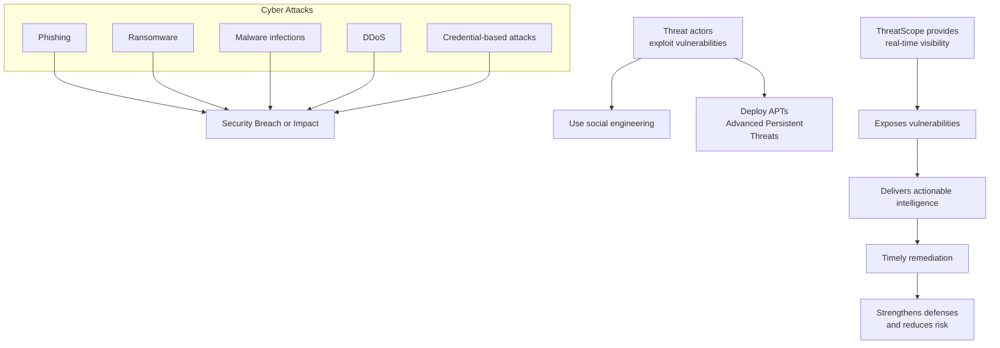

# ThreatScope

<a href="https://threatscope-i0tj.onrender.com/" target="_blank">ThreatScope</a>  is a cloud-based platform for monitoring and alerting on cyber threats, built to deliver intelligence that is specific to your business context. It runs continuously, reducing the need for a large in-house security team while ensuring your intellectual property and digital assets remain protected. Even if your comapny does not have large expert cyber security team, you can sleep calmly that your IP and all other assets are protected. ThreatScope gives you a cyber security monitoring and alerting solution that is customized to your business needs. It is very easy to use. You just select in our webapp your industry and operational regions to provide insights relevant to you cyber threats. The threats categories you are able to monitor are comprehensive and range from threat **actors**, **malware** and indicate the **risk levels**. By delivering sector-specific threat intelligence, it allows your security teams to anticipate, detect and respond to cyber risks fast, proactively. 

Getting started is simple: choose your industry and operational regions in the web app, and ThreatScope delivers threat insights that are directly relevant to your environment. The platform tracks a broad range of activity, including known threat actors, active malware campaigns, and their associated risk levels. For teams that prefer direct integration, the same tailored threat data can be accessed programmatically through the ThreatScope API, enabling you to pull intelligence into your own dashboards, SIEMs, or workflows.

The platform tracks a broad range of activity, including known threat actors, active malware campaigns, and their associated risk levels. By combining real-time alerts with sector-specific intelligence, ThreatScope gives your team the visibility needed to anticipate attacks, detect ongoing campaigns, and prioritize responses before risks escalate. It integrates into existing security operations as a reliable source of context-driven threat intelligence, keeping your defenses proactive rather than reactive.

